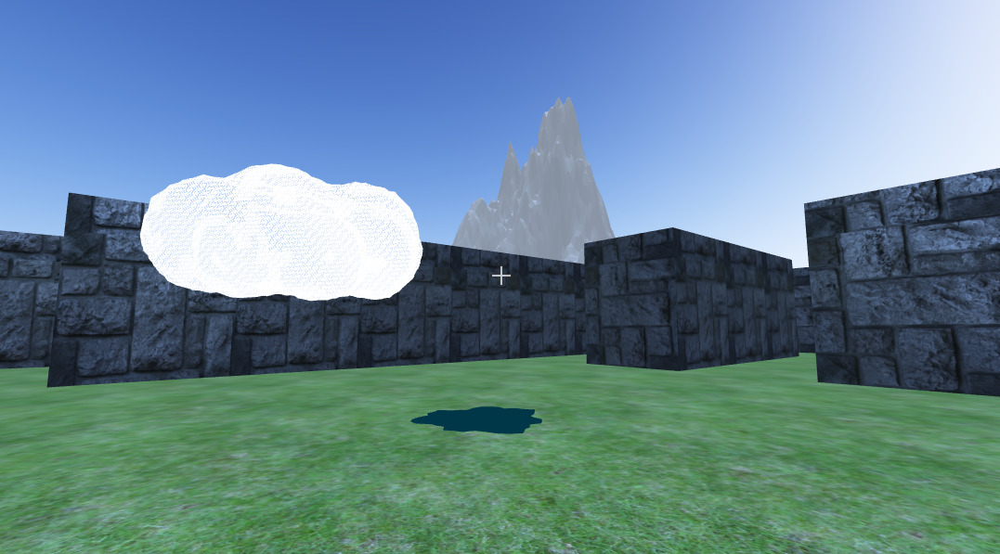

# Project

## Logistics

The project is organized in multiple files to make the management of the code much easier than just dumping all code in a single file for the scene and its components. At the same time organization is key because having to navigate between files for things that are closely related adds unnecessary complexity. The following illustrates the file structure for our code:

```
📂src
 ├─ 📄custom-shaders.js
 ├─ 📄custom-shapes.js
 ├─ 📄hosek-wilkie-color.js
 ├─ 📄hosek-wilkie-shader-strings.js
 ├─ 📄math-extended.js
 ├─ 📄movement.js
 ├─ 📄ripple-rampage.js
 └─ 📄utilities.js
```

Similarly, we organized our assets in separate categories in case names for similar assets of different categories are named similarly. For example, if I have a mountain wavefront file (OBJ), and a texture for that mountain the names might clash and potentially lead to reading the wrong file. Therefore we opted for different folders for different types of assets as illustrated below:

```
📂images
 ├─ 📷...
 └─ ...
📂objects
 ├─ 🍩...
 └─ ...
📂textures
 ├─ 🧱...
 └─ ...
```

Another important goal of this structure is not just to avoid large monolithic files, but also to make merge conflicts much easier to manage.

## How to play

The `server.py` script has been modified so that when laucnhed it will automatically open your default browser at `localhost:8000`. All you have to do is run `server.py` directly with python or launch with the dedicated scripts for each OS.



Once you are in the game you should see something similar to the picture above. The game is a 3D third-person game in which you are in a maze. Your goal is to find the cloud seen in the picture in the maze and bring it back to the start to fill the well in the middle of the maze. The keybinds are the following

|Action | Key |
|-|-|
|Walk forward| w|
|Walk backward| s|
|Strafe left| a|
|Strafe right| d|
|Jump| space|
|Toggle flashlight| f|
|Make it rain| r |
|Look around| mouse |
|grab/let go | click |

## Suggestions to add code

The main branch is protected so that only code through merges can be commited to it. A good practice is to have an appointed member of a small team be the reviewer so that only one person merges at a time. This prevents overriding someone else's work.

Additionally, a suggested style for branches is the following `action/title`. For example, if you are fixing a bug do `fix/bug-with-code`, or if adding a new feature `feature/make-it-rain`. For commit messages, try to follow git suggested style. That is use imperative mood in the subject line. For example, if you fixed a bug say `fix bug with x` instead of `fixed bug with x`. The reason for this is that when going through the commit history, it is much more natural to read what the commit is gonna do when applied than to think of what the author did.
